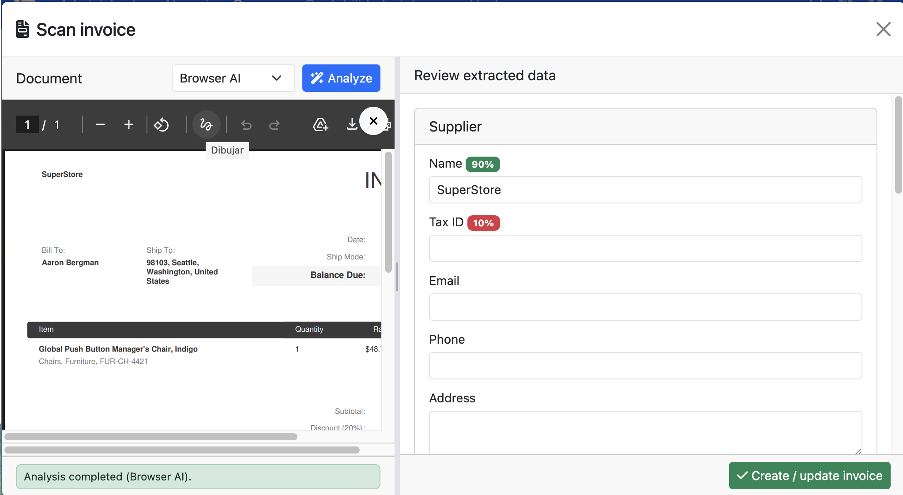
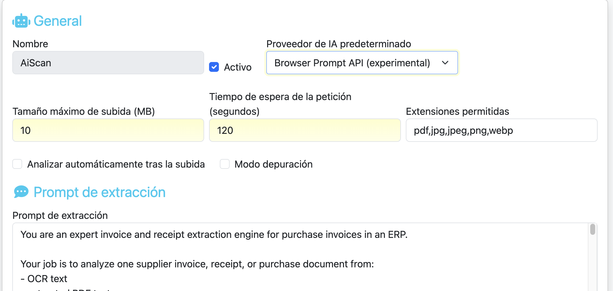

# AiScan para FacturaScripts

 
<small><a href="https://erseco.github.io/facturascripts-playground/?blueprint=https%3A%2F%2Fraw.githubusercontent.com%2Ferseco%2Ffacturascripts-plugin-AiScan%2Frefs%2Fheads%2Fmain%2Fblueprint.json">Try in your browser</a></small>

Plugin de IA para importar facturas de proveedor en FacturaScripts. Sube uno o varios PDFs o imágenes, deja que la IA extraiga los datos y revísalos antes de crear las facturas de compra.

## Cómo funciona

AiScan tiene su propia pantalla dentro del menú **Compras**. Desde ella puedes subir uno o varios archivos a la vez (PDFs, imágenes), seleccionar el proveedor de IA y lanzar el análisis de todos los documentos en paralelo.

Cada documento se procesa de forma independiente y el resultado se presenta en un panel de revisión donde puedes validar o corregir proveedor, cabecera, impuestos y líneas antes de importar la factura. Si subes varios archivos, un asistente te guía documento a documento.

  

## Características

- **Pantalla dedicada de importación**: accesible desde el menú de Compras, permite subir múltiples archivos de golpe
- **Procesamiento en paralelo**: analiza varios documentos simultáneamente para ahorrar tiempo
- **Asistente multi-documento**: navega entre los documentos subidos revisando y corrigiendo cada uno
- **Extracción asistida por IA**: soporta OpenAI, Google Gemini, Mistral y endpoints compatibles con OpenAI
- **IA local en Google Chrome**: también puede usar la `Browser Prompt API` de Chrome para ejecutar el análisis en local, sin enviar la factura a servicios externos
- **Detalle de líneas editable**: modal de edición para cada línea con búsqueda de productos, impuestos, retenciones y descuentos
- **Detección de proveedores y productos**: empareja automáticamente proveedores por NIF/CIF o nombre, y busca productos existentes por SKU o descripción
- **Validación y normalización**: revisa el esquema devuelto por la IA antes de mapearlo a la factura
- **Adjunta el original**: guarda el PDF o imagen subida como archivo adjunto de la factura
- **Prompt base + instrucciones adicionales**: el prompt de extracción se mantiene actualizado con cada versión del plugin; el usuario puede añadir instrucciones propias que se concatenan al prompt base
- **Compatibilidad**: FacturaScripts 2025 y PHP 8.1 o superior

## Configuración

Tras instalar el plugin, entra en **Administración > AiScan** desde el panel de administración.

  

- **Proveedor de IA**: OpenAI, Google Gemini, Mistral, un endpoint compatible con OpenAI o la `Browser Prompt API`
- **Modelo**: el modelo concreto que se usará para la extracción
- **Peticiones en paralelo**: número máximo de documentos que se analizan simultáneamente
- **Modo depuración**: guarda más información en logs para diagnosticar respuestas del proveedor
- **Extensiones permitidas**: define qué tipos de archivo se aceptan
- **Instrucciones adicionales**: permite añadir indicaciones extra al prompt de extracción (se puede consultar el prompt base desde un botón en la misma pantalla)

## Proveedores compatibles

- **OpenAI**: requiere clave API de OpenAI
- **Google Gemini**: requiere clave API de Google AI Studio
- **Mistral**: requiere clave API de Mistral
- **OpenAI compatible**: válido para servicios como Ollama, LM Studio u otros endpoints con API compatible
- **Browser Prompt API (experimental)**: usa el motor de IA integrado en Google Chrome para procesar el documento en local, sin claves API ni envío de datos a la nube. Para usarlo necesitas una versión compatible de Google Chrome con las funciones de IA activadas. Más información: <https://developer.chrome.com/docs/ai/prompt-api>

## Uso

1. Ve a **Compras > AiScan** en el menú principal.
2. Sube uno o varios PDFs o imágenes.
3. Selecciona el proveedor de IA (o déjalo en el predeterminado).
4. El análisis se lanza automáticamente en paralelo.
5. Revisa los datos extraídos de cada documento: proveedor, cabecera, líneas e impuestos.
6. Corrige lo necesario y confirma para crear la factura de compra.
7. Si has subido varios archivos, el asistente te lleva al siguiente documento.

## Detección de proveedores y productos

AiScan intenta emparejar automáticamente el proveedor extraído con los proveedores existentes en FacturaScripts, primero por NIF/CIF y después por nombre. Si hay varias coincidencias, permite elegir el proveedor correcto.

También intenta reutilizar productos existentes a partir del SKU o de la descripción de las líneas cuando encuentra una coincidencia clara. El usuario puede buscar y seleccionar manualmente un producto desde el modal de detalle de cada línea.

## Instalación

1. Descarga el ZIP desde [Releases](../../releases/latest)
2. Ve a **Panel de Admin > Plugins** en FacturaScripts
3. Sube el archivo ZIP y activa el plugin
4. Entra en **Administración > AiScan** y configura el proveedor de IA que quieras usar

## Requisitos

- FacturaScripts 2025 o superior
- PHP 8.1 o superior

## Desarrollo

- `make upd` — arranca los contenedores Docker
- `make lint` — comprueba el estilo de código
- `make format` — corrige automáticamente el estilo
- `make test` — ejecuta los tests unitarios
- `make package VERSION=1.0.0` — genera el ZIP de distribución

## Licencia

LGPL-3.0. Ver [LICENSE](LICENSE) para más detalles.
